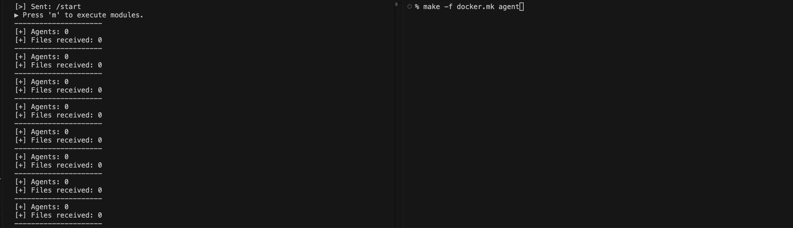

# c2gram
#### Telegram based c2c infrastructure
###### Proof-of-concept, uses [gitrojan](https://github.com/WillGAndre/explo/tree/main/gitrojan) for remote module execution

### Requirements
- Telegram App and bot
  - App ID and hash
  - Phone number
  - Bot channel
  - Bot token
- Github repo
  - User
  - Token
  - Repo

### Quick-start
1. Set environment variables: `.env.c`
2. `make -f local.mk build-c`
3. `make -f local.mk build-a`
4. `make -f local.mk controller`
5. `make -f local.mk agent`
- `docker.mk` for Docker

----



### Current Architecture
<pre>
           Push              Push
Controller ----> Telegram   <---- Agent -<-<-<- Github
          <----- Bot Channel ---->              Repo
           Pull              Pull
</pre>

Pushing and pulling operations are performed based on controller defined topic identifiers (`topic_id`), where messages assume the following format: `<topic_id>:<encrypted_json>`.

Both the controller and the agent have a [`shared`](./shared/utils.py) encryption and decryption scheme to be able to communicate over the insecure medium.

## Controller

<p align="left">
  
</p>

Contoller mimics a Telegram user by using [Telethon](https://docs.telethon.dev/en/stable/developing/philosophy.html) to delegate operations. After agent enrollment, contollers are able to:

&nbsp;&nbsp; - Request agents to import and execute remote python code from Github (*module*, [ref](https://github.com/WillGAndre/explo/tree/main/gitrojan)).

---

<br><br><br>

**Ping**
```json
  {
    "msg": "PING:<AGENT_IDS>",
    "timestamp": "..."
  }
```
<pre>
           Push              | 1. Start session
Controller ----> Telegram    | 
          <----- Bot Channel |
           Pull              | 2. Receive Beacon, deliver Ping
</pre>

<br>

**Module**
```json
  {
    "agent_id": "<HOSTNAME>:<UUID>",
    "mdl": "<mdl>",
    "user": "<user>",
    "token": "<token>",
    "repo": "<repo>",
    "timestamp": "..."
  }
```
<pre>
           Push              | 3. Deliver Module
Controller ----> Telegram    | 
          <----- Bot Channel |
           Pull              | 4. Receive results as file
</pre>
- Considering the proof-of-concept: "[explo](https://github.com/WillGAndre/explo/tree/main)" is used as `repo` with default config file "[gitrojan/config/def.json](https://github.com/WillGAndre/explo/blob/main/gitrojan/config/def.json)". Both the [module config file](https://github.com/WillGAndre/explo/blob/main/gitrojan/config/def.json) and effective [modules](https://github.com/WillGAndre/explo/tree/main/gitrojan/modules) (to execute) must be stored in Github.

## Agents

<p align="left">
  
</p>

Worker units that receive pre-defined tasks to run. Currently, agents are able to:

&nbsp;&nbsp; - Import and execute remote python code stored in Github repositories;

---

<br><br>

**Beacon**
```json
  {
    "agent_id": "<HOSTNAME>:<UUID>",
    "msg": "BEACON",
    "timestamp": "..."
  }
```
<pre>
            Push       | 1. (Session start) Deliver Beacon
Telegram   <---- Agent |
Bot Channel ---->      |
            Pull       | 2. Receive Ping
</pre>

<br>

**File**
```json
  {
    "agent_id": "<HOSTNAME>:<UUID>",
    "msg": "MODULE:<MODULE_RESULTS>",
    "timestamp": "..."
  }
```
<pre>
            Push                      | 5. Deliver results as file 
Telegram   <---- Agent -<-<-<- Github | 4. Import module as blob
Bot Channel ---->              Repo   |
            Pull                      | 3. Receive Module
</pre>

<br><br>

---

<i>Built for experimentation, useful in theory, abandoned in practice.</i>

<i>A short-lived dive into lightweight execution—fun to tinker with, pointless to pursue.</i>

---